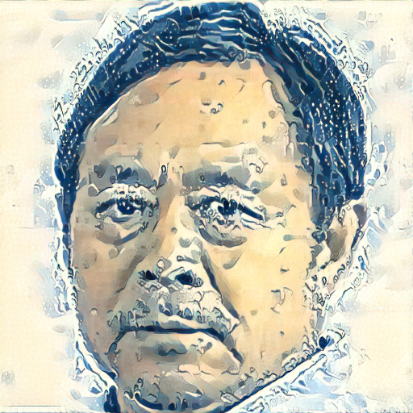

# Toy Style Transfer

Requirements: PyTorch >= 1.12.1

Usage:

```bash
python main.py -c images/mbg.png -s images/style.jpg -o images/mbg_cool.png -d cuda:0
```

Print usage message:

```bash
python main.py -h
```

## Result

<div>
    </img>
    </img>
    </img>
</div>

## References

- <https://pytorch.org/tutorials/advanced/neural_style_tutorial.html>
